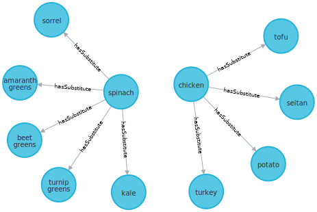

# Neo4j-Docker
This repository consists of instructions to set up neo4j and jupyter notebook using docker.

## Steps to run
### 1. Initial Set-up
* Download the most recent version of docker as per your OS from here - https://docs.docker.com/desktop/release-notes/ and install the docker on your system
* Open and run the docker application
* Clone this repository and rename as per your project
* In the project folder which is a cloned version of this git repository, change the $USER and $UID in .env file. To find out the values `echo $USER` and `echo $UID` from your command terminal
* Create two folders insider the project folder 
* * A folder to save the graph database, that is, the knowledge graph (`neo4j_graph_data`)
* * A folder where the original raw data files are stored (`neo4j_raw_data`)
* Mention these paths in the docker-compose.yml file. Mention full path (use `pwd` to find out full path).
* * `<path to neo4j_raw_data>:/import`
* * `<path to neo4j_graph_data>:/data`
* There is folder inside this project folder named `neo4j_plugins` which consists of required plugins. Add the path as below in the docker-compose.yml (NOTE: Better to put this somewhere outside the project folder)
* * `<path to plugins>:/var/lib/neo4j/plugins`
* Create a virutal environment `python3 venv -m <env_name>`. This creates a folder as `<env_name>`. Add this to .gitignore for good practice.
* Activate the virtual env using `source <env_name>/bin/activate`
* Install required packages `pip install -r requirements.txt`


### 2. Stand up Docker
As mentioned before, standing up docker will stand up a neo4j community version and a jupyter notebook as well. Independent of the notebook, the neo4j can be accessed via python script as well <br>
* Command to stand up the docker container `docker compose up --build`. Use `--build` the very first time you are running. From next time, you can simply do `docker compose up` as this saves time by not pulling the items from docker cloud everytime. It will simply reuse the image you built the first time
* Wait for the following to appear in your terminal before you launch neo4j and jupyter notebook
```
INFO  ======== Neo4j 5.16.0 ========
...
...
INFO  Started.
```
* Access the notebook and neo4j from ports `https://localhost:8888` and `https://localhost:7474` respectively. You can change the port numbers in docker-compose.yml file in case you have two projects that use neo4j.
* Username and password for neo4j is in .env file
* Password for Jupyterlab is in .env file
* Sample code on how to load the data is in the following sections
* Command to get the docker container down `docker compose down -v` if we want to remove the volumes mounted. Or, simply do `docker compose down`

### 3. Load sample graph
The `data` folder consists of all the data you may have in any formats - .json, images, .csv and etc. We need to create an intermediate csv format that will allow us to load data into neo4j in batches. You can also load .json directly to neo4j. The following steps will demonstrate loading data in batches and in parallel. This is a good practice if you expect your graph to scale. <br>

The use-case we have is ingredient subsitution knowledge graph. We will be utilizing a subset of the dataset as shown in Figure below. The `data` folder consists of data on ingredients, substitution pairs and images. The scripts that convert this raw data into intermediate csv format to batch load into neo4j is present in `scripts` folder. 
<br>
<div style="text-align: center; margin-bottom: 20px;">
  <figure style='display: table'>
  
  <p>
    Figure 1: Subset of sample knowledge graph for ingredient substitution
  </p>
</figure>
</div>

<br>

* Run the file `python neo4j_csv.py`. This will read the files from `data` folder and create intermediate csv files and saves in `neo4j_raw_data` folder.

* **IMAGES**: To load the ingredient images, we can use any model and convert it to embedding vector and load it into graph or as we can save filepaths. Do `json.dumps(embed)` for embeddings before loading to neo4j. When querying from neo4j for processing, do `json.loads(embed)` to convert it back to python list and then to torch or numpy as needed. The sample code is in jupyter notebook. If you want to just save embeddings as a file, use H5PY format for efficient processing.

* Once the intemediate data is prepared, navigate to `https://localhost:8888` to open jupyter notebook and run the notebook file to load the data to neo4j. The password to launch jupyter notebook is in .env file

* Once the graph is loaded, you can visualize it through the following steps. 


### 4. Query sample graph
* Navigate to `https://localhost:7474` to open neo4j from the browser. The username and password is in .env file

* Type the query `MATCH (n)-[r]-(m) RETURN n,r,m` in the browser and execute it to visualize the graph. Learn more about CYPHER query lanugage for other queries


### 5.Access Neo4j from Python files
You can access the neo4j data using jupyter notebook or python scripts for your downstream tasks. By default, the docker pulls neo4j and jupyter notebook from the docker cloud. If you do not wish to use Jupyter notebook, you can uncomment that part in the docker-compose.yml file

#### Jupyter Notebook
* The `notebook` folder is added as a path in docker-compose.yml file. Any .ipynb file created inside this folder will be accessible by docker. Stand up the docker and then create files inside this folder from `https://localhost:8888`
* The notebooks will allow you to interact with neo4j and perform operations such as load data, modify, delete or use it for any downstream purposes.

#### Python Scripts
* The `python_to_neo4j` folder has a boiler plate that establishes connection to neo4j (after standing it up using docker). The file name is `neo4j_connection.py`. Do not modify this file unless necessary
* The file `sample.py` demonstrates how to access the data from neo4j by utilizing class declared in `neo4j_connection.py` by setting appropriate credentials


### ERRORS
* if `docker command not found` after the installation, add it to your path. For mac, `export PATH="$PATH:/Applications/Docker.app/Contents/Resources/bin/" `. Link - https://stackoverflow.com/questions/64009138/docker-command-not-found-when-running-on-mac 

* if `OSError:No space left on deivce` while running docker compose, do `docker system prune -af`. Link - https://stackoverflow.com/questions/44664900/oserror-errno-28-no-space-left-on-device-docker-but-i-have-space 


